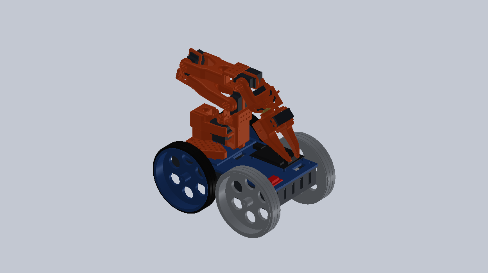
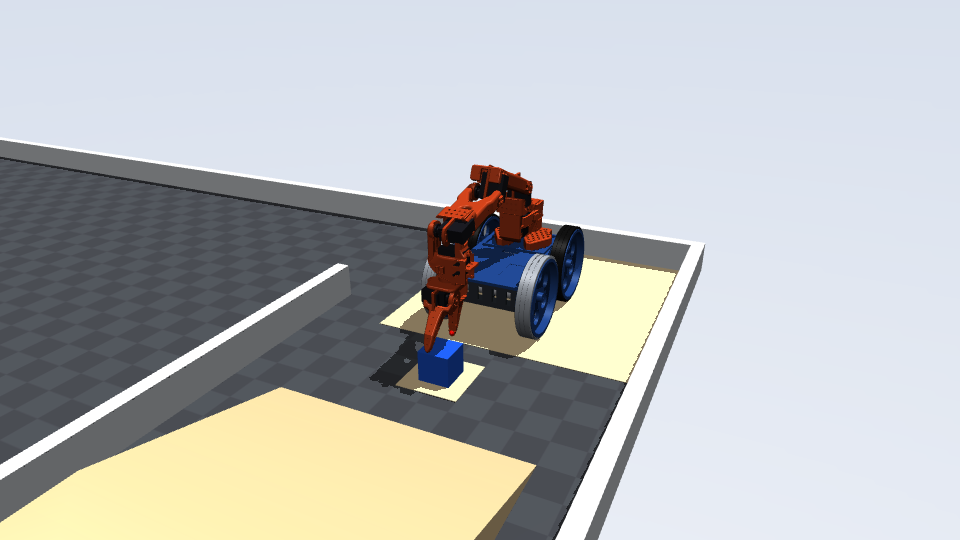
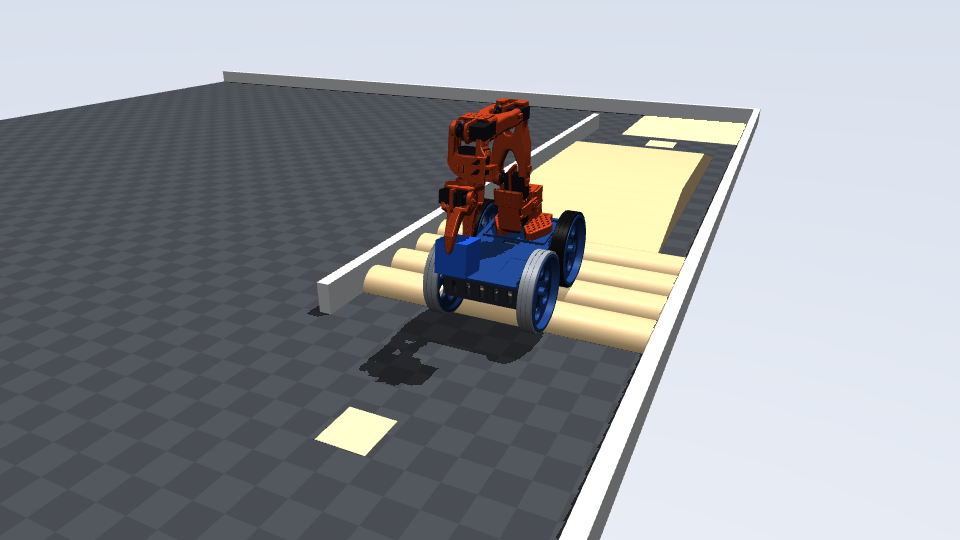
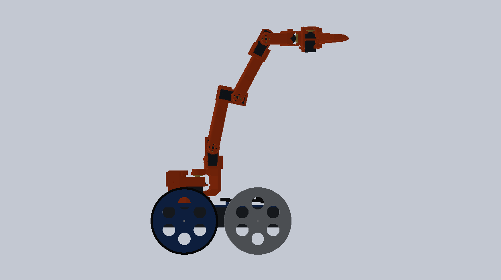
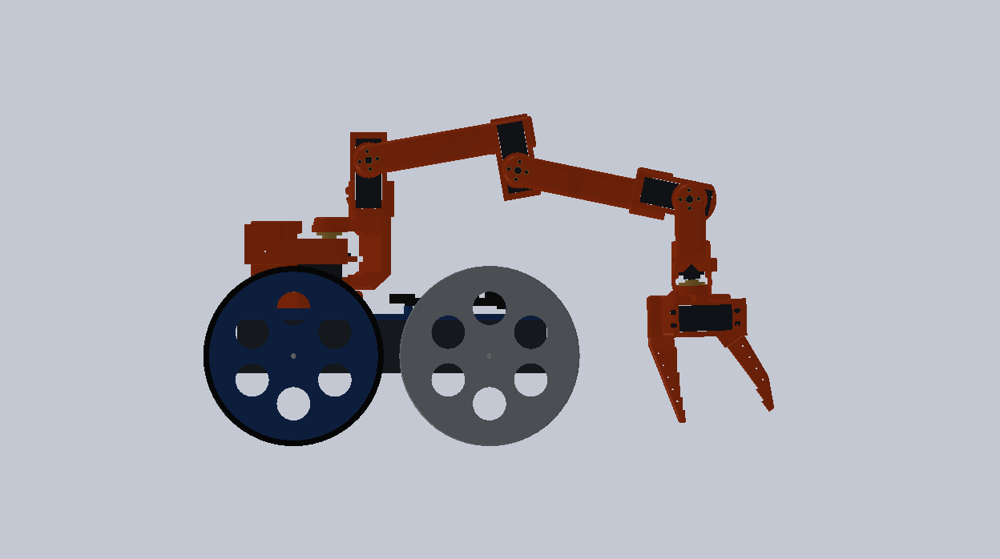
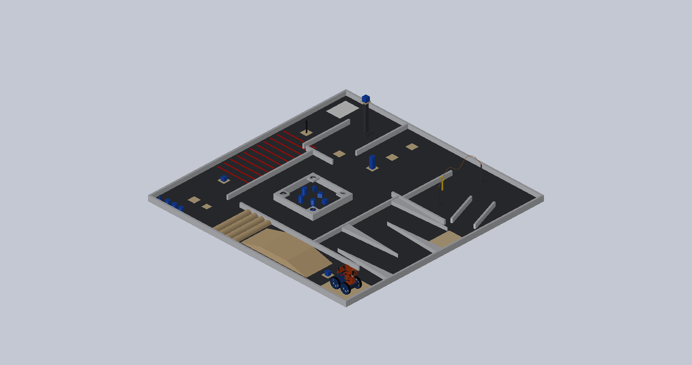
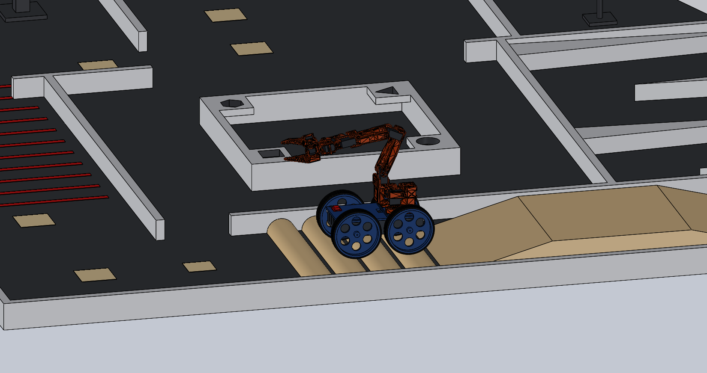

# Thenar Walker — RoboReach 2026-27 robot

A 12 V four-wheel drive base for the **[thenar-arms](https://github.com/nickthelegend/thenar-arms)
MG996R follower arm**, built for [Techfest IIT Bombay RoboReach](https://techfest.org/competitions/roboreach).
The arm is unchanged; it is driven wirelessly by the thenar-arms **encoder leader** plus a joystick.
Everything is native SolidWorks 2026, generated by scripts so it can be rebuilt after any change.



| | |
|---|---|
| Start size (STOW) | **293.7 × 196.0 × 292.9 mm** (rule 300 × 200 × 300) |
| Ground clearance | **57 mm** (rule ≥ 50) |
| Object centre at REACH_450 | **449.6 mm** in SolidWorks (rule: object centred at 450) |
| Mass | 2.37 kg (CAD) |
| Drive | 4 × 25GA-370 **12 V 60 RPM** (103:1), Ø140 printed wheels (one-piece PETG front, TPU-tyred rear), skid steer, ~0.34 m/s |
| Power | 3S LiPo 2200 mAh (12.6 V max, rule ≤ 24 V), 15 A fuse, 30 A kill switch |
| Link | ESP32 Wi-Fi AP `<TeamName>_TF`, HMAC-SHA256 signed commands, disconnect HOLD |

### Current build (October 2026) — what the team is actually building

The parts bought locally differ from the original design above, and the printable files follow the real parts:

| | |
|---|---|
| Motors | 4 × 370 plastic-gearbox 12 V ~100 RPM (gearbox Ø37.5, M8 × 13 collar + 13 mm nut, Ø6 round shaft). Bottle test passed (≥ ~5.2 kg·cm); simulated at 100 rpm: passes from 4.9 kg·cm |
| Chassis tub | **tub v2** — `cad/tools/tub_v2.py` (mesh CAD, 11/11 fit checks in `cad/evidence/tub_v2_checks.json`): M8 collar through 13 mm wall pads, nut pockets, walls to 100 mm, engraved **THENAR.IO** / **THENARLABS**. Ground clearance 51.25 mm, 294 × 196 mm |
| Deck | 3 mm wooden board cut to 250 × 138 — template `docs/wood_deck/` |
| Motor driver | Cytron **MDD10A** (one board, PWM + DIR), on the deck top |
| Wheels | 6 mm-bore versions (plate 4b), flat TPU tyre strips (plates 5F / 5G) |
| Assembly film | **[Watch / download the 4-minute assembly film](https://github.com/nickthelegend/thenar-walker/releases/tag/v1)** — every part and every connection, built from this CAD (`videos/thenar-assembly`) |

The SolidWorks assembly and `docs/VERIFICATION.md` still show the original 25 mm-motor tub; resync them when SolidWorks is available.

Full measured results: **[docs/VERIFICATION.md](docs/VERIFICATION.md)** (SolidWorks) and
**[docs/SIMULATION.md](docs/SIMULATION.md)** (physics: it drives the course and picks things up).

### It runs the course (MuJoCo physics + the real firmware logic in the loop)

| Scenario | Result |
|---|---|
| A — pick 50 mm cube → 15° ramp → bridge → ramp down → 4 speed breakers → place in the 80 mm square | **PASS 7/7** · [video](sim/out/mission_A.mp4) |
| B — same, with a 1.5 s Wi-Fi drop on the bridge + 75 forged/replayed packets | **PASS 12/12** — stops, arm freezes, gripper holds, attacks rejected · [video](sim/out/mission_B.mp4) |
| C — Downy: 60 mm cube off the 400 mm pole, arc turns like a driver, place in its square | **PASS 5/5** · [video](sim/out/mission_C.mp4) · [spin-in-place version](sim/out/mission_C_spin.mp4) |

| | |
|---|---|
|  |  |

## Contents

| Path | What |
|---|---|
| `cad/assemblies/Thenar_Walker.SLDASM` | Robot. Configurations **STOW**, HOME, REACH_450, PICK_FLOOR, DRIVE_ONLY |
| `cad/arena/RoboReach_Arena.SLDASM` | 3 × 3 m arena with all game objects, robot parked at the start |
| `cad/arena/Terrain_Check.SLDASM` | Robot on the ramp / bridge / speed breakers (last checked pose) |
| `cad/parts/` | Robot parts (RR-xx printed, P-xx purchased envelopes) |
| `cad/print/` | **Ready Bambu P1S plates** (5 × 3MF, no supports) — see [cad/print/PRINT.md](cad/print/PRINT.md) |
| `cad/stl/` | Single-part STLs |
| `cad/vendor/thenar-arms/` | thenar-arms follower master + parts (Apache-2.0, SO-ARM100 derived) with the four pose configurations added |
| `cad/tools/` | Python (pywin32) scripts that build and verify everything in SolidWorks |
| `analysis/` | URDF kinematics, collision-aware stow search, gripper opening, drive sizing |
| `sim/` | MuJoCo model of robot + arena, firmware-in-the-loop bridge, mission scenarios, videos (`sim/out/`) |
| `firmware/` | Robot + controller ESP32 sketches, shared `ThenarLink` library, host unit tests |
| `docs/` | [BOM](docs/BOM.md) · [Wiring](docs/WIRING.md) · [Build guide](docs/ASSEMBLY.md) · [Design notes](docs/DESIGN.md) · [Verification](docs/VERIFICATION.md) · [Simulation](docs/SIMULATION.md) |

| | |
|---|---|
|  |  |
| REACH_450 — object centred at 449.6 mm | PICK_FLOOR — 50 mm cube on the floor |
|  |  |
| Arena (rulebook layout, ±10 %) | Over the 40 mm speed breakers |

## Rebuild / re-verify (SolidWorks 2026 must be running)

```
python cad/tools/build_parts.py          # all parts + STL
python cad/tools/make_plates.py          # P1S print plates (cad/print)
python cad/tools/prepare_arm.py          # arm pose configurations, cross-checked vs URDF
python cad/tools/build_robot.py          # robot assembly
python cad/tools/verify_robot.py         # rule checks (start box, clearance, reach, interference, stability)
python cad/tools/build_arena.py          # arena parts
python cad/tools/build_arena_asm.py      # arena assembly + terrain interference checks
python cad/tools/render_robot.py         # renders
python cad/tools/make_report.py          # docs/VERIFICATION.md
```

The scripts only open and close their own documents; other SolidWorks work stays open.
Python: `pywin32 numpy trimesh scipy python-fcl rtree`.

## Simulation

```
python sim/build_model.py            # MuJoCo model from the CAD numbers
python sim/run_mission.py A          # also B, C   (add --novideo to skip rendering)
python sim/turn_study.py             # skid-steer turning study (tyres / motors / spin vs arc)
python sim/make_sim_report.py        # docs/SIMULATION.md
```
Needs `mujoco imageio imageio-ffmpeg` and `sim/fw_bridge.exe` (build: `g++ -std=gnu++14 -O2 -static -o sim/fw_bridge.exe sim/fw_bridge.cpp`).

## Firmware

```
python firmware/tools/new_key.py "Your Team Name"
powershell -File firmware/tests/run_tests.ps1          # 39 host checks: SHA-256/HMAC, auth, replay, failsafe, turning
powershell -File firmware/tools/compile_firmware.ps1   # both ESP32 sketches
```

## Status

CAD, kinematics, collisions, obstacle clearance, the full course in physics simulation and the firmware
logic are verified in software. Nothing has been built or powered yet: check purchased parts against the
CAD, measure real tyre/gripper friction, calibrate the servos, and run the failsafe test in
`docs/ASSEMBLY.md` before the event.
