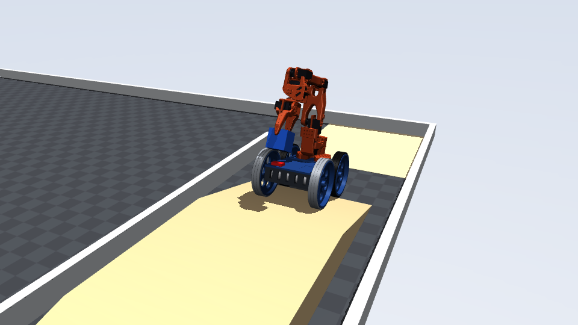
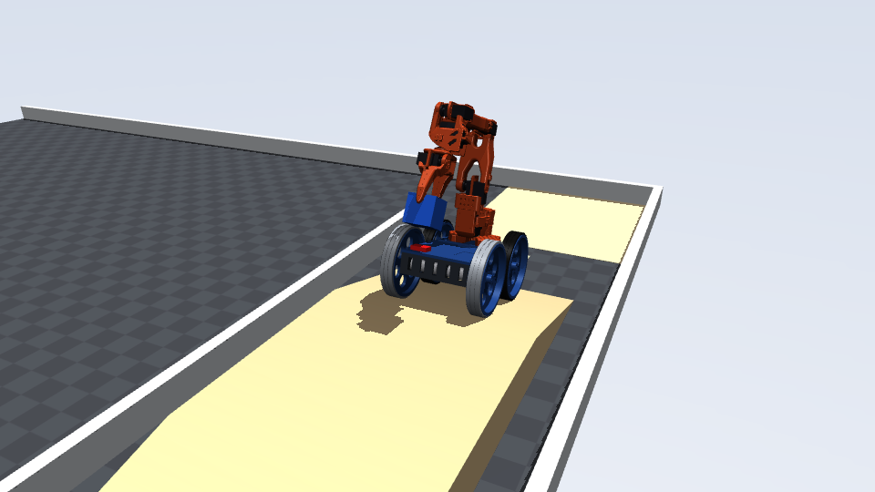
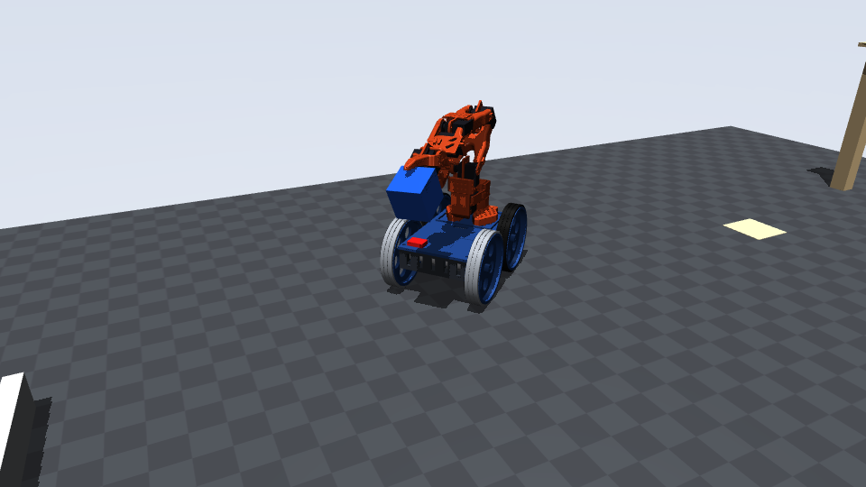
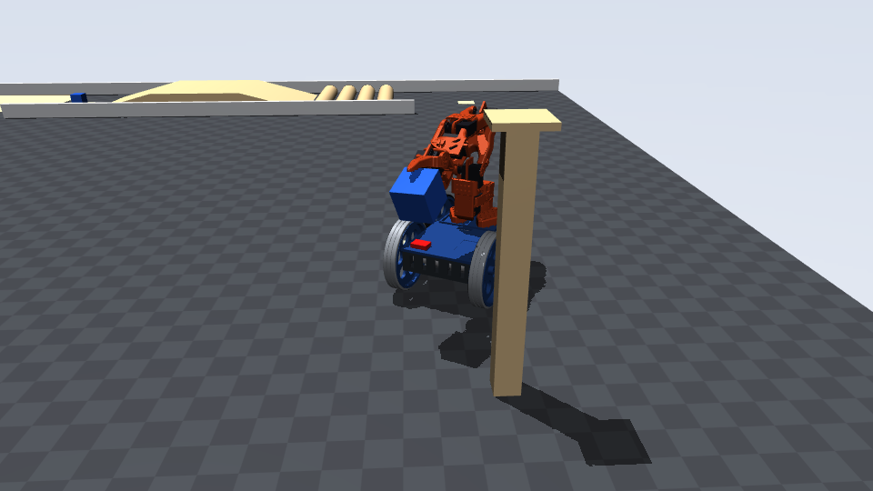

# End-to-end simulation — Thenar Walker

Generated by `sim/make_sim_report.py`. Physics: MuJoCo 3.14, 1 ms steps. Control: the **real firmware logic** (`firmware/libraries/ThenarLink`: HMAC packet gate + `tw::Robot` state machine) compiled into `sim/fw_bridge.exe` and run every 10 ms. The operator (leader-arm angles + joystick) is scripted: it sees the scene like a person would and only sends what a person could send — nothing bypasses the firmware.

| Scenario | Result | Simulated time | Video |
|---|---|---|---|
| A: Main course — pickup → 15° ramp → bridge → ramp down → 4 speed breakers → touchdown | **PASS** (7/7) | 27.9 s | [mission_A.mp4](../sim/out/mission_A.mp4) |
| B: Same course + 1.5 s radio drop on the bridge while forged and replayed packets are sent | **PASS** (12/12) | 29.3 s | [mission_B.mp4](../sim/out/mission_B.mp4) |
| C: Downy — 60 mm cube off the 400 mm pole, reverse/forward arc turns, place in the target square | **PASS** (5/5) | 54.6 s | [mission_C.mp4](../sim/out/mission_C.mp4) |
| C_spin: Downy again, but turning by spinning in place instead of arcs | **PASS** (5/5) | 32.4 s | [mission_C_spin.mp4](../sim/out/mission_C_spin.mp4) |

## Scenario A — Main course — pickup → 15° ramp → bridge → ramp down → 4 speed breakers → touchdown

| Result | Check | Measured |
|---|---|---|
| PASS | Robot never tips (|roll| < 25 deg, |pitch| < 25 deg) | max |pitch| 15.3 deg, max |roll| 0.1 deg |
| PASS | Chassis / motors never touch an obstacle (only tyres do) | no contacts |
| PASS | Pickup: cube lifted clear of the ground | max cube height 290 mm |
| PASS | Cube held by the gripper the whole way (no drop) | 1341 samples from pickup to touchdown, 0 with the cube > 20 mm from the grasp point |
| PASS | Climbed the 15 deg ramp and crossed the 400 mm bridge | max chassis lift 80.0 mm (bridge = 80) |
| PASS | Drove down and over all four 40 mm speed breakers | rear axle passed y = 0.597 m |
| PASS | Placed completely inside the 80 x 80 mm square | cube centre offset (+2.5, +13.1) mm, z 25.0 mm |

Events: 2.4 s approach_error_mm = 3.1891238748290585; 8.5 s cube50_in_hand_offset_mm = [-24.8, 0.0, 5.8]; 8.5 s cube50_lifted_to_mm = 101.9; 8.5 s ik_unreachable; 17.1 s place_align_error_mm = 15.798148342652695; 18.4 s cube50_in_hand_offset_mm = [-25.1, 0.0, 12.4]

## Scenario B — Same course + 1.5 s radio drop on the bridge while forged and replayed packets are sent

| Result | Check | Measured |
|---|---|---|
| PASS | Robot never tips (|roll| < 25 deg, |pitch| < 25 deg) | max |pitch| 15.3 deg, max |roll| 0.1 deg |
| PASS | Chassis / motors never touch an obstacle (only tyres do) | no contacts |
| PASS | Pickup: cube lifted clear of the ground | max cube height 290 mm |
| PASS | Cube held by the gripper the whole way (no drop) | 1482 samples from pickup to touchdown, 0 with the cube > 20 mm from the grasp point |
| PASS | Climbed the 15 deg ramp and crossed the 400 mm bridge | max chassis lift 80.0 mm (bridge = 80) |
| PASS | Drove down and over all four 40 mm speed breakers | rear axle passed y = 0.597 m |
| PASS | Placed completely inside the 80 x 80 mm square | cube centre offset (+2.4, +12.5) mm, z 25.0 mm |
| PASS | Forged + replayed packets during the drop are all rejected | 75 attack packets, 0 accepted |
| PASS | Link lost -> firmware HOLD within 260 ms, wheel duty 0 | state during drop: [2] |
| PASS | Robot stops (speed < 2 cm/s by the end of the drop) | speed 0 mm/s at end, rolled 11 mm after HOLD |
| PASS | Arm motion ceases (joint drift < 2 deg during HOLD) | max joint drift 0.21 deg |
| PASS | Gripper keeps holding the cube through the drop | cube stayed in the jaws |

Events: 2.4 s approach_error_mm = 3.1891238748290585; 8.5 s cube50_in_hand_offset_mm = [-24.8, 0.0, 5.8]; 8.5 s cube50_lifted_to_mm = 101.9; 8.5 s ik_unreachable; 12.8 s RADIO DROP begins (robot on the bridge); 14.3 s radio restored; 18.5 s place_align_error_mm = 15.797412824933716; 19.8 s cube50_in_hand_offset_mm = [-25.1, 0.0, 12.5]

## Scenario C — Downy — 60 mm cube off the 400 mm pole, reverse/forward arc turns, place in the target square

| Result | Check | Measured |
|---|---|---|
| PASS | Robot never tips (|roll| < 25 deg, |pitch| < 25 deg) | max |pitch| 0.1 deg, max |roll| 0.0 deg |
| PASS | Chassis / motors never touch an obstacle (only tyres do) | no contacts |
| PASS | Downy: 60 mm cube taken off the 400 mm pole | max cube centre 539 mm |
| PASS | Turned to face the target square (final aim error < 3 deg) | {"style": "reverse arc + forward arc", "duration_s": 14.8, "rotation_travelled_deg": 284.4, "final_aim_error_deg": 0.05, "peak_motor_current_A_total": 2.27, "mean_motor_current_A_total": 1.02, "mean_battery_current_A_motors": 0.44, "time_above_80pct_stall_s": 0.0} |
| PASS | Placed completely inside the 100 x 100 mm square | cube centre offset (+3.2, -10.2) mm, z 30.0 mm |

Events: 2.4 s approach_error_mm = 3.193155147488469; 9.2 s cube60_lifted_off_pole_mm = 22.4; 17.4 s arc_turn (reverse) heading error deg = -2.97; 23.2 s arc_turn (forward) heading error deg = -2.98; 26.9 s turn_in_place_final_error_deg = 0.05; 26.9 s place_align_error_mm = 3.2568950317535816; 32.6 s cube60_in_hand_offset_mm = [-33.3, 7.8, 5.4]

## Scenario C_spin — Downy again, but turning by spinning in place instead of arcs

| Result | Check | Measured |
|---|---|---|
| PASS | Robot never tips (|roll| < 25 deg, |pitch| < 25 deg) | max |pitch| 0.1 deg, max |roll| 0.0 deg |
| PASS | Chassis / motors never touch an obstacle (only tyres do) | no contacts |
| PASS | Downy: 60 mm cube taken off the 400 mm pole | max cube centre 539 mm |
| PASS | Turned to face the target square (final aim error < 3 deg) | {"style": "spin in place", "duration_s": 3.8, "rotation_travelled_deg": 145.2, "final_aim_error_deg": -0.15, "peak_motor_current_A_total": 1.69, "mean_motor_current_A_total": 1.2, "mean_battery_current_A_motors": 0.57, "time_above_80pct_stall_s": 0.0} |
| PASS | Placed completely inside the 100 x 100 mm square | cube centre offset (-8.3, +6.9) mm, z 30.0 mm |

Events: 2.4 s approach_error_mm = 3.193155147488469; 9.2 s cube60_lifted_off_pole_mm = 22.4; 16.0 s turn_in_place_final_error_deg = -0.15; 16.0 s place_align_error_mm = 3.2811744713195923; 19.6 s cube60_in_hand_offset_mm = [-32.6, 7.9, 4.3]

## Turning study (`sim/turn_study.py`)

The robot is almost square (wheelbase 152 mm, track 168 mm), so every turn drags tyres sideways. With grippy TPU on all four wheels it could only spin above ~55 % power and **arc turns barely worked (2.8°/s)** — in an arc test it reversed 2 m and turned 26°. Stronger (slower) motors barely help. Hard PETG tyres at the **front** let the front slide while the TPU rear pushes: spin and arcs both work, it still climbs the ramp and crosses the speed breakers (scenarios A and B). PETG at the **rear** was also tried and gets stuck on the breakers.

| Variant | spin_35%_deg_s | spin_65%_deg_s | spin_100%_deg_s | arc_30/90%_deg_s | arc_speed_m_s | straight_100%_m_s | climbs_ramp_at_35% |
|---|---|---|---|---|---|---|---|
| JGA25 78:1 (6.2 kg.cm, 77 rpm), all TPU  [current] | 0.2 | 31.6 | 83.6 | 2.8 | 0.31 | 0.53 | True |
| JGA25 131:1 (~10 kg.cm, ~46 rpm), all TPU | 7.5 | 32.1 | 64.4 | 5.3 | 0.19 | 0.32 | True |
| JGA25 171:1 (~12 kg.cm, ~35 rpm), all TPU | 8.2 | 26.5 | 52.8 | 6.3 | 0.15 | 0.24 | True |
| JGA25 78:1, PETG front / TPU rear | 20.0 | 77.0 | 136.2 | 14.3 | 0.31 | 0.53 | True |

Firmware: rotation has its own scale (50/75/100 %) and a 35 % breakaway floor (`TURN_SCALE`, `SPIN_MIN` in `tw_robot.h`). Drive like a car where you can (arcs); spin on the spot only for small corrections or tight spots.

## Model inputs and assumptions

* Masses: SolidWorks volumes × PETG/TPU densities + datasheet masses; arm link COM/inertia integrated over the thenar-arms meshes. Robot 2.37 kg.
* Arm kinematics: thenar-arms `simulation/mujoco/so101.xml` (URDF-validated). Finger contacts: 3 boxes per finger fitted to the jaw meshes (gap is 4–16 mm tighter than the real jaws — conservative).
* Wheels: Ø140 cylinders; JGA25-370 78:1 torque–speed line (stall 6.2 kg·cm, 77 rpm free) × battery 11.6/12 V.
* Servos: MG996R as stall-limited position servos; firmware slew limit applied first.

| Assumption | Value |
|---|---|
| tyre_friction_TPU_on_ply | 0.9 |
| tyre_friction_PETG_on_ply | 0.35 |
| front_tyre_material | PETG |
| rear_tyre_material | TPU |
| finger_friction | 1.0 |
| object_friction_thermocol | 0.7 |
| cube50_mass_kg | 0.02 |
| cube60_mass_kg | 0.03 |
| servo_stall_Nm | 1.08 |
| servo_kp_Nm_per_rad | 30.0 |
| gripper_kp_Nm_per_rad | 3.0 |
| servo_armature | 0.004 |
| wheel_armature | 0.004 |
| motor | 25GA-370 / JGA25-370 12 V 103:1 (60 rpm free, rated 2.7 kg.cm @ 46 rpm, stall 8.2 kg.cm / 1.3 A) |
| motor_stall_Nm | 0.8041453 |
| motor_free_rad_s | 6.283185307179585 |
| battery_V_over_12 | 0.9666666666666667 |

## What the simulation does not prove

* Friction values are assumptions (TPU on plywood, thermocol on PETG). Test the real tyres on the ramp and the real gripper on a thermocol cube.
* Thermocol is modelled rigid; a real EPS cube dents under ~10 N — squeeze gently (gripper 15–20° on the leader).
* The scripted operator has perfect eyes and a steady hand. Practise the course: the human is the controller.
* Wi-Fi is modelled as packet delivery/loss only (no latency jitter, no interference).

## What-if: 25GA-370 **100 RPM** motors (the ones the team could buy locally)

`TW_MOTOR_RPM=100 TW_MOTOR_STALL_KGCM=<x> TW_TAG=... python sim/run_mission.py A|B|C` (baseline results untouched):

| Stall torque | A (ramp, bridge, breakers, place) | B (radio drop) | C (Downy, turn, place) |
|---|---|---|---|
| 3.6 kg·cm | FAIL — stuck on the speed breakers | — | — |
| 4.2 kg·cm | FAIL — speed breakers | — | — |
| 4.5 kg·cm | FAIL — speed breakers | — | — |
| **4.9 kg·cm** (same motor, 100 rpm gearing) | **ALL PASS** | **ALL PASS** | arcs at normal speed brush the corridor wall; **ALL PASS** with the arcs in precision mode, and with spin-in-place |

So the 100 rpm motor works only if it really makes ≥ ~4.9 kg·cm (bottle test: lift 750 ml at 7 cm), with
precision mode for manoeuvring near the poles.
